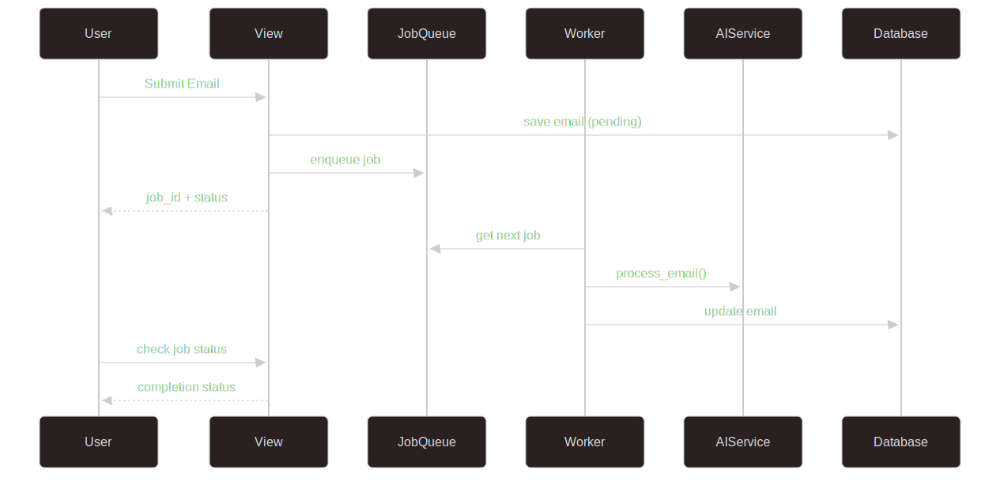

# Visão Geral da Arquitetura

## Estrutura do Sistema

O Email Classifier System segue uma arquitetura baseada em Django com processamento assíncrono e integração com APIs de IA.

## Componentes Principais

### 1. Camada de Apresentação
- **Views Django**: Renderização de templates e APIs REST
- **Templates**: Interface web para submissão e visualização
- **CORS Middleware**: Suporte a requisições cross-origin

### 2. Camada de Negócio
- **AI Service**: Integração com Google Gemini AI
- **Job Queue**: Sistema de filas para processamento assíncrono
- **Rate Limiter**: Controle de uso de APIs externas
- **Utils**: Processamento de arquivos PDF/TXT

### 3. Camada de Dados
- **Models Django**: Email, com campos de classificação
- **SQLite**: Banco de dados para desenvolvimento
- **File Storage**: Upload e armazenamento de arquivos

## Fluxo de Processamento

### Processamento Assíncrono (Recomendado)
")

## Padrões Arquiteturais

### Singleton Pattern
- **JobQueue**: Instância única para toda a aplicação
- **RateLimiter**: Controle centralizado de rate limiting

### Factory Pattern
- **Job Creation**: Criação de jobs baseada em tipos registrados
- **Handler Registration**: Registro dinâmico de manipuladores

### Observer Pattern
- **Job Callbacks**: Notificações quando jobs são concluídos
- **Status Updates**: Atualizações automáticas de status

## Configurações de Ambiente

O sistema utiliza variáveis de ambiente para configuração:

- `GEMINI_API_KEY`: Chave da API do Google Gemini
- `DEBUG`: Modo de debug do Django
- `SECRET_KEY`: Chave secreta do Django
- `ALLOWED_HOSTS`: Hosts permitidos
