# Sistema de Classificação de Emails

## Visão Geral

O sistema classifica emails em duas categorias principais usando IA e fallback heurístico.

## Categorias

### Productive (Produtivo)
Emails que requerem ação ou atenção:
- Problemas técnicos e solicitações de suporte
- Reuniões e agendamentos
- Projetos e atualizações de status
- Perguntas e solicitações
- Questões relacionadas ao trabalho

### Unproductive (Improdutivo)
Emails informativos ou sociais:
- Parabéns e felicitações
- Agradecimentos e elogios
- Newsletters e informativos
- Convites sociais
- Feedback positivo

## Métodos de Classificação

### 1. Google Gemini AI (Primário)

#### Modelo Utilizado
- **Modelo**: `gemini-1.5-flash`
- **Configuração**: Temperature 0.7, Top-p 0.95

#### Prompt de Classificação
```python
prompt = f"""
Analise o seguinte email e classifique-o como:
- 'productive' (emails que requerem ação, contêm problemas, perguntas, solicitações, questões técnicas ou assuntos relacionados ao trabalho)
- 'unproductive' (emails de parabéns, notas de agradecimento, boletins informativos, convites, elogios)

Email para analisar:
{full_content}

Regras para classificação:
- Emails sobre reuniões, agendamentos ou disponibilidade devem sempre ser classificados como 'productive'
- Emails com problemas técnicos, solicitações de suporte ou perguntas são 'productive'
- Emails contendo principalmente elogios, parabéns ou conteúdo social são 'unproductive'
- Em caso de dúvida, incline-se para a classificação 'productive'

Responda APENAS com "productive" ou "unproductive" e inclua um valor de confiança de 0-100.
Formato: "classificação|valor_confiança"
"""
```

### 2. Sistema Heurístico (Fallback)

Usado quando a API Gemini não está disponível ou rate limit é atingido.

#### Palavras-chave Improdutivas
```python
improdutivo_keywords = [
    "parabéns", "feliz", "aniversário", "congratulações",
    "agradecimento", "obrigado", "newsletter", "informativo",
    "convite", "festa", "celebração", "elogio", "satisfação"
]
```

#### Palavras-chave Produtivas
```python
produtivo_keywords = [
    "suporte", "problema", "erro", "bug", "solicitação", "ajuda",
    "dúvida", "sistema", "atualização", "relatório", "urgente",
    "incidente", "falha", "acesso", "login", "senha", "não funciona"
]
```

#### Regras Especiais
- Emails com "reunião" + "confirmar" → sempre productive
- Feedback positivo com "impressionado" + "satisfação" → unproductive

## Fluxo de Classificação



## Níveis de Confiança

### Gemini AI
- **Alta confiança**: 85-100% - Classificação clara
- **Média confiança**: 70-84% - Classificação com alguma incerteza
- **Baixa confiança**: 50-69% - Classificação duvidosa

### Sistema Heurístico
- **Confiança fixa**: 75% - Baseado em palavras-chave

## Contextos de Email

O sistema detecta diferentes contextos para melhor classificação:

### Reuniões
- Palavras-chave: "reunião", "agenda", "disponibilidade", "confirmar"
- Sempre classificado como productive

### Suporte Técnico
- Palavras-chave: "suporte", "problema", "erro", "bug", "falha"
- Sempre classificado como productive

### Projetos
- Palavras-chave: "projeto", "atualização", "status", "progresso"
- Geralmente classificado como productive

### Feedback
- Palavras-chave: "feedback", "opinião", "satisfação", "experiência"
- Classificação baseada no tom (positivo/negativo)

## Estatísticas de Desempenho

O sistema mantém estatísticas de:
- Taxa de uso da API Gemini vs Heurística
- Distribuição de níveis de confiança
- Tempo médio de processamento
- Rate limiting e fallbacks
