# Sistema de Filas (Job Queue)

## Visão Geral

O sistema de filas permite processamento assíncrono de emails, evitando timeouts e melhorando a experiência do usuário.

## Componentes

### Job Class
Representa um job individual na fila.

#### Status Possíveis
- `QUEUED`: Na fila, aguardando processamento
- `PROCESSING`: Em processamento
- `COMPLETED`: Processado com sucesso
- `FAILED`: Falhou durante processamento
- `EXPIRED`: Expirou na fila sem ser processado

#### Atributos
```python
class Job:
    id: str              # UUID único
    job_type: str        # Tipo do job
    data: Dict           # Dados para processamento
    status: str          # Status atual
    result: Any          # Resultado (quando completo)
    error: str           # Erro (quando falha)
    created_at: datetime # Timestamp de criação
    started_at: datetime # Timestamp de início
    completed_at: datetime # Timestamp de conclusão
    callback: Callable   # Função de callback
    position_in_queue: int # Posição na fila
```

### JobQueue Class (Singleton)
Gerencia a fila de jobs e workers.

#### Métodos Principais

##### `enqueue(job_type, data, priority, callback)`
```python
job_id = job_queue.enqueue(
    job_type="process_email_complete",
    data={
        'subject': 'Assunto do email',
        'content': 'Conteúdo do email',
        'sender': 'user@example.com',
        'email_id': 123
    },
    priority=1,  # 1 = alta prioridade
    callback=my_callback_function
)
```

##### `get_job(job_id)`
```python
job = job_queue.get_job("uuid-do-job")
if job:
    print(f"Status: {job.status}")
```

##### `get_queue_status()`
```python
status = job_queue.get_queue_status()
# Retorna informações sobre fila atual
```

## Tipos de Jobs

### process_email_complete
Processamento completo de um email (classificação + resposta).

#### Dados Necessários
```python
{
    'subject': str,
    'content': str,
    'sender': str,
    'email_id': int  # ID do email no banco
}
```

#### Handler
```python
def handle_process_email_complete(data):
    email_data = {
        'subject': data.get('subject', ''),
        'content': data.get('content', ''),
        'sender': data.get('sender', '')
    }
    email_id = data.get('email_id')
    return process_email_and_update(email_data, email_id)
```

### classify_email
Apenas classificação de email.

#### Dados Necessários
```python
{
    'subject': str,
    'content': str
}
```

### suggest_response
Apenas geração de resposta.

#### Dados Necessários
```python
{
    'subject': str,
    'content': str,
    'category': str
}
```

### process_document
Processamento de documento/arquivo.

#### Dados Necessários
```python
{
    'file_content': str,
    'file_type': str
}
```

## Sistema de Prioridades

A fila usa `PriorityQueue` com níveis de prioridade:

- **1**: Alta prioridade (processamento completo, documentos)
- **2**: Média prioridade (geração de resposta)
- **3**: Baixa prioridade (tarefas de manutenção)

## Worker Thread

### Funcionamento
- Thread daemon que roda continuamente
- Processa jobs em ordem de prioridade
- Trata exceções e atualiza status
- Cleanup automático de jobs antigos

### Ciclo de Processamento



## Monitoramento

### Status da Fila
```python
status = job_queue.get_queue_status()
```

#### Retorna
```python
{
    "queue_length": 3,
    "active_job": {
        "id": "uuid",
        "job_type": "process_email_complete",
        "status": "processing"
    },
    "estimated_wait": 9,  # segundos
    "queued_jobs": [...],  # primeiros 5 jobs
    "processing_count": 1
}
```

### Status Individual
```python
job = job_queue.get_job(job_id)
job_dict = job.to_dict()
```

#### Retorna
```python
{
    "id": "uuid-do-job",
    "job_type": "process_email_complete",
    "status": "completed",
    "created_at": "2023-12-01T10:00:00Z",
    "started_at": "2023-12-01T10:00:05Z",
    "completed_at": "2023-12-01T10:00:08Z",
    "position_in_queue": 0,
    "estimated_wait_time": 0,
    "processing_time": 3.0,
    "has_result": true,
    "has_error": false
}
```

## Configurações

### Timeouts
- **Job expiration**: 1 hora para jobs não processados
- **Cleanup interval**: A cada job processado
- **Max age**: 1 hora para jobs concluídos

### Thread Management
- **Daemon thread**: Termina com o processo principal
- **Stop timeout**: 5 segundos para parada graceful
- **Error handling**: Continue operação mesmo com erros

## Uso Recomendado

### Para Processamento Longo
```python
# Em vez de processamento síncrono
result = process_email(email_data)

# Use processamento assíncrono
job_id = queue_complete_email_processing(email_data, email_id)
return {"job_id": job_id, "status": "queued"}
```

### Para Monitoramento
```python
# Frontend pode consultar status
job = job_queue.get_job(job_id)
if job.status == "completed":
    # Exibir resultado
    email = Email.objects.get(pk=email_id)
```
